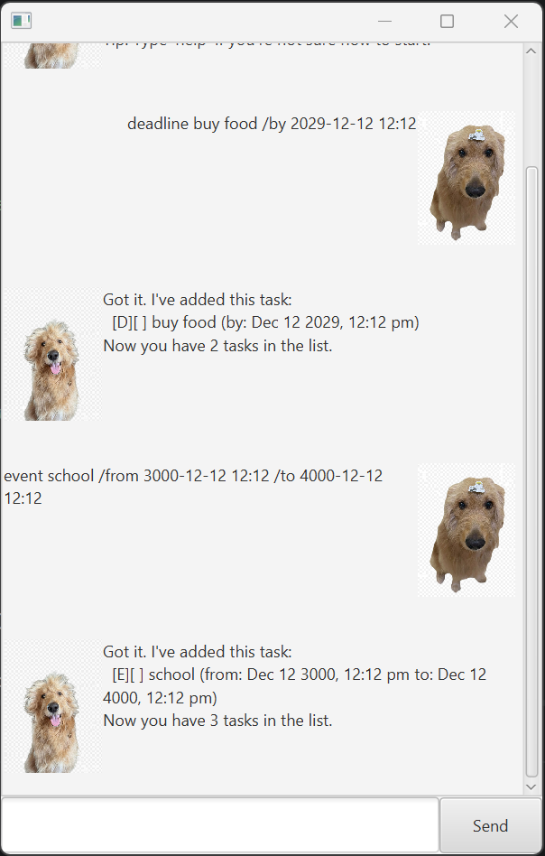

# BenBot User Guide

BenBot is a desktop task management application optimized for use via a Command Line Interface (CLI) while providing a clean, 
visual chat experience powered by JavaFX.

## Quick Start
Ensure you have Java 17 or above installed.

Download the latest benbot.jar from the Releases page.

Open a terminal, navigate to the folder, and run: java -jar benbot.jar

When the app opens, BenBot will greet you and show your current task list!

## Features
### 1. View Help: help 

If you forget any commands, BenBot can show you a quick guide.

**Format**: **help**

**Outcome**: Displays a list of all available commands and their syntax.

### 2. Manage Tasks: todo, deadline, event
Add various types of tasks to your list.

Todo: todo [description]

Deadline: deadline [description] /by [date/time]

Event: event [description] /from [start date/time] /to [end date/time]

**Example**:
deadline Return library book /by 2026-03-01

### 3. Search Tasks: find
   Find specific tasks using keywords.

**Format**: find [keyword]

**Example**: find book

**Expected Output**:

Here are the matching tasks in your list:
1.[D][ ] Return library book (by: 2026-03-01)

### 4. Delete Tasks: delete
   Remove an entry from your list using its index number.

**Format**: delete [index]

## Technical Design Principles
AI-Assisted Development
This project utilized AI assistance for specific architectural improvements:

**Refactoring for SLAP**: Used AI to restructure the Parser class, extracting low-level string manipulation into private helper methods to maintain a Single Level of Abstraction.

**KISS Principle**: Applied AI suggestions to simplify the BenBot logic dispatcher, replacing a monolithic switch-case with clean, delegated handler methods.

**Robustness**: Implemented regex-based parsing (\\\s+) suggested by AI to handle irregular user whitespace input.

## Data Persistence
BenBot automatically saves your tasks to ./data/benbot.txt. If the file or directory does not exist, BenBot creates it for you on startup.
